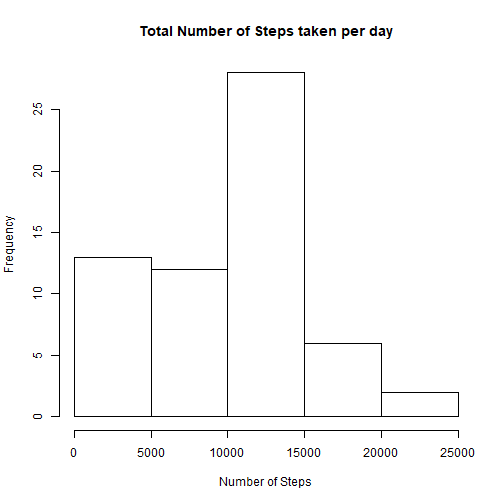
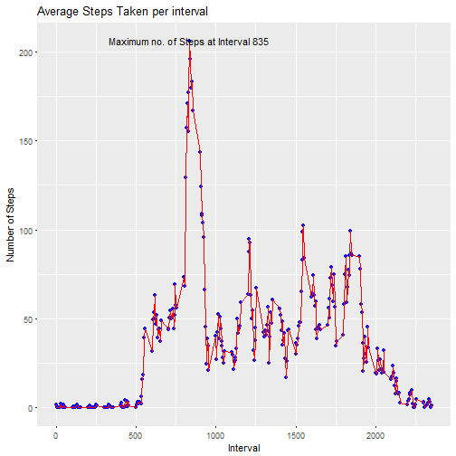
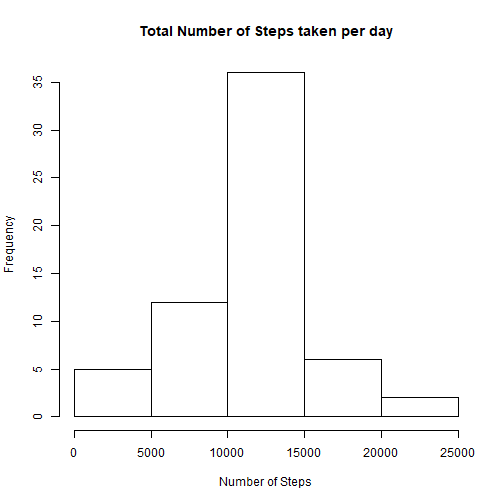
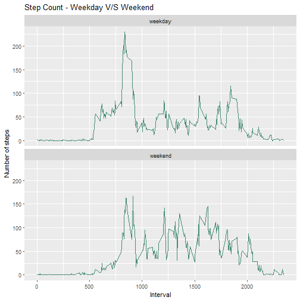

### Loading and preprocessing the data

```r
library(readr)
library(dplyr)
library(ggplot2)
library(knitr)

datas <- read_csv("activity.zip")
datas$steps <- as.numeric(datas$steps)
```
### Mean total number of steps taken per day


```r
#### Calculating the total number of steps taken per day

 total_step <- group_by(datas,date)
 total_step <- summarise(total_step,sum(steps,na.rm = TRUE))
 names(total_step) <- c("date","total")
#### Plotting histogram 
 hist(total_step$total,main = "Total Number of Steps taken per day", xlab = "Number of Steps",ylab =      "Frequency")
```



```r
 #### Calculating the mean and median of no of steps
 
 mean_step <- mean(total_step$total,na.rm = TRUE)
 median_step <- median(total_step$total,na.rm = TRUE)
 print(paste("Mean of total number of steps :",mean_step))
```

```
## [1] "Mean of total number of steps : 9354.22950819672"
```

```r
 print(paste("Median of total number of steps :",median_step))
```

```
## [1] "Median of total number of steps : 10395"
```
### Average daily activity pattern

```r
 avg_step <- group_by(datas,interval)
 avg_step <- summarise(avg_step,mean(steps,na.rm = TRUE))
 names(avg_step) <- c("interval","avg")
 max_step_index <- which.max(avg_step$avg)
#### Plotting the average steps across the 5 min intervals 
 g <- ggplot(avg_step,aes(interval,avg))  
 g + geom_point(col = "blue") +geom_line(col = "red")+ labs(title = "Average Steps Taken per interval", x = "Interval",y = "Number of Steps")+
   geom_text(data = avg_step[max_step_index,],
             label = paste("Maximum no. of Steps at Interval",avg_step$interval[max_step_index]))
```



### Imputing missing values and plotting histogram again


```r
 miss <- which(is.na(datas))
 print(paste("No. of missing rows in data : ", length(miss)))
```

```
## [1] "No. of missing rows in data :  2304"
```

```r
#### Missing value replacement : Every NAs in steps is replaced by mean of no of steps in that date
 impute.mean <- function(x) replace(x, is.na(x), mean(x, na.rm = TRUE))
 dat2 <- datas %>%
      group_by(interval) %>%
      mutate(steps = impute.mean(steps))
 total_step <- group_by(dat2,date)
 total_step <- summarise(total_step,sum(steps,na.rm = TRUE))
 names(total_step) <- c("date","total")
 hist(total_step$total,main = "Total Number of Steps taken per day", xlab = "Number of Steps",ylab = "Frequency")
```



```r
#### Calculating the new median and mean after imputing missing values
 
 mean_step <- mean(total_step$total,na.rm = TRUE)
 median_step <- median(total_step$total,na.rm = TRUE)
 print(paste("Mean of total number of steps :",mean_step))
```

```
## [1] "Mean of total number of steps : 10766.1886792453"
```

```r
 print(paste("Median of total number of steps :",median_step))
```

```
## [1] "Median of total number of steps : 10766.1886792453"
```

### Differences in activity patterns between weekdays and weekends


```r
 weekend <- c("Sunday","Saturday")
 week_f <- function(dates) {ifelse((weekdays(dates) %in% weekend),1,0)}
 dat2$day_f <- sapply(dat2$date,week_f)
 dat2$day_f <- factor(dat2$day_f,levels = c("0","1"), labels = c("weekday","weekend"))
 avg_step <- group_by(dat2,interval,day_f)
 avg_step <- summarise(avg_step,mean(steps,na.rm = TRUE))
 names(avg_step) <- c("interval","day_f","avg") 
#### Plotting the activity pattern differences in weekdays and weekends
 g <- ggplot(avg_step, aes(interval,avg))
 g + geom_line(color="aquamarine4")+facet_wrap(~day_f,nrow = 2)+
   labs(x = "Interval", y = "Number of steps",title = "Step Count - Weekday V/S Weekend")
```




